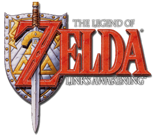

# NeuroLink


A reinforcement learning project built on the Game Boy emulator PyBoy to train agents to solve rooms in "The Legend of Zelda: Link’s Awakening". The repo includes custom Gym-style environments, training/testing scripts, state management utilities, and tools to record gameplay GIFs.


## Features
- Custom Gym-compatible environments per room with tailored reward functions.
- Image abstraction pipeline to downsample raw frames for RL.
- Training via different RL methods.
- Utilities to load/save emulator states.


## Project Structure
- game_state/
  - Saved emulator states and room checkpoints used for training/testing.
- RL/
  - envs/
    - base_env.py: Base environment implementing Gym API and common helpers.
    - room-specific envs with custom reward functions.
    - screen_abstract.py: Gaussian convolution/downsampling from 128×160×4 to 8×10×1.
  - train.py: Train an RL agent.
  - test.py: Evaluate a trained agent.
- utils/
  - save_state.py: Read and save emulator states.
  - save_gif.py: Record GIFs during training or manual play.
- img/
  - overview.png: Room overview illustration.

## Set up

Install (recommended: Conda):
```bash
git clone https://github.com/CrazyJassBread/Link-s-awakening-RL.git
cd Link-s-awakening-RL.git
```
after that
```bash
conda create -n zelda python=3.10
conda activate zelda
pip install -r requirements.txt
```

Or you can install the requirements by yourself
```bash
pip install pyboy stable-baselines3 gymnasium numpy imageio pynput matplotlib
```

## Data and ROM
Place the game ROM and states under game_state/:
- game_state/Link's awakening.gb
- game_state/Room58_task2.state (for example)

## Usage

### Train
```bash
python RL/train.py
```
- Configure hyperparameters and environment selection inside RL/train.py.

### Test
```bash
python RL/test.py
```
- Loads the trained model and runs evaluation in the selected room environment.

### Manual Play & utils
Use the SDL2 window to play manually and save a full GIF:
```bash
python utils/save_gif.py
```
Controls:
- Press q to quit and save the GIF.
Output:
- record/human_play/test.gif (or manual_play.gif depending on config)

### Create your own task
you can make your own env using the `utils/save_state.py`. After saving your target room, you can write a new file (eg:env_54.py) and place it in the folder `RL/envs/ `
## Environment Details
- Base environment follows the Gym API: reset(), step(action), render(mode="rgb_array").
- screen_abstract.py applies Gaussian convolution and downsampling from 128×160×4 to 8×10×1 for efficient learning. However 
- Each room environment customizes rewards to guide the agent towards completing specific tasks.

## Tips
- When recording GIFs during training, ensure render(mode="rgb_array") is called every step in the evaluation loop.
- Limit MAX_FRAMES to prevent excessive memory usage.
- For headless runs, use window="null" in PyBoy; for manual play, use window="SDL2".

## References
- Game memory info: https://datacrystal.tcrf.net/wiki/The_Legend_of_Zelda:_Link%27s_Awakening_(Game_Boy)
- Game guide: https://www.zeldadungeon.net/
- PyBoy emulator: https://github.com/Baekalfen/PyBoy
- Related work: https://github.com/PWhiddy/PokemonRedExperiments
- stable baselines3: https://github.com/DLR-RM/stable-baselines3
## License
This project is only for research and educational purposes. 
