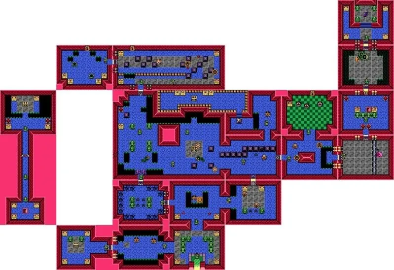

# Link's awakening RL
## 项目框架

#### game state

game_state中保存了各种需要的游戏状态和迷宫关卡

### RL
RL目录下则记录当前对环境的封装、强化学习算法的定义，可以使用train.py来训练模型，用test.py来测试训练结果

**envs**：
- base_env 作为基类，定义了Gym的API接口、一些通用辅助函数
- 其余房间则在继承了base_env的基础上采用了自定义的reward function
- screen_abstract中定义了对游戏画面的高斯卷积函数，可以将 128 * 160 * 4的原始图像降维到 8 * 10 * 1

### utils
**save_state**:

可以读取游戏状态并手动保存需要的游戏阶段

## 环境简介
一号迷宫缩略图如下所示

## 参考

游戏内存信息：[The Legend of Zelda: Link's Awakening (Game Boy) - Data Crystal](https://datacrystal.tcrf.net/wiki/The_Legend_of_Zelda:_Link%27s_Awakening_(Game_Boy))

GameBoy模拟器：[PyBoy](https://github.com/Baekalfen/PyBoy?tab=readme-ov-file)

Pokemon项目：[PokemonRedExperiments](https://github.com/PWhiddy/PokemonRedExperiments/blob/master/v2/red_gym_env_v2.py)